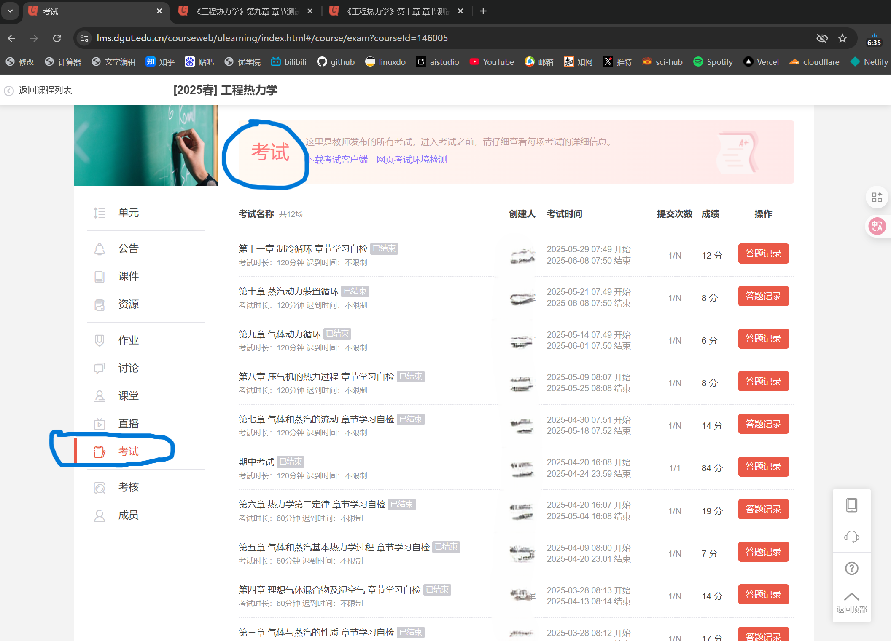

# 优学院考试导出工具 (ulearning-export)

从优学院导出考试题目数据，支持标准优学院和东莞理工学院版本。

## 工作原理

### API 接口分析

优学院的考试系统基于前后端分离架构，前端通过 REST API 与后端通信。本工具通过分析浏览器网络请求，找到了关键的数据接口：

```
GET /exams/user/study/getExamReport?examId={examId}&traceId={userId}
```

该接口返回完整的考试报告 JSON 数据，包含：
- 考试基本信息（标题、时间等）
- 所有题目数据（题干、选项、答案、解析）
- 题目中嵌入的图片 URL

### 平台差异

| 平台 | API 地址 | 前端地址 |
|------|----------|----------|
| 标准优学院 | `utestapi.ulearning.cn` | `utest.ulearning.cn` |
| 东莞理工学院 | `lms.dgut.edu.cn/utestapi` | `lms.dgut.edu.cn` |

两个平台的 API 结构完全相同，仅域名不同。

### 认证机制

请求需要携带 `Authorization` 请求头，值为登录后获取的 Token。Token 存储在：
- Cookie: `AUTHORIZATION` 或 `token`
- 请求头: `authorization`

Token 有时效性，过期后需重新从浏览器获取。

### 数据处理流程

```
浏览器获取参数 → 调用API获取JSON → 解析题目数据 → 下载图片 → 生成导出文件
     ↓                                    ↓
  examId                              题干/选项/答案
  traceId (userId)                    HTML → 纯文本
  authorization                       图片URL → 本地文件
```

## 功能特点

- 支持多平台：标准优学院、东莞理工学院优学院
- 多种导出格式：JSON模板、Markdown、TeX、纯文本
- 自动下载题目中嵌入的所有图片
- 提供 Python GUI 程序和油猴浏览器脚本两种使用方式
- JSON 导出格式兼容 AI 提示词模板

## 项目结构

```
ulearning-export/
├── python/                 # Python 版本
│   ├── main.py            # GUI 主程序
│   ├── config.py          # 平台配置
│   ├── api.py             # API 通信
│   ├── utils.py           # 工具函数
│   ├── exam_report_exporter.py    # 标准答案报告导出
│   └── student_paper_exporter.py  # 学生试卷/用户答案导出
├── js/
│   └── ulearning-export.user.js  # 油猴脚本
└── tmpl.jsonc             # JSON 模板格式说明
```

## 环境要求

- Python 3.x
- Python 库: `requests`, `beautifulsoup4`

```bash
pip install requests beautifulsoup4
```

## 使用方法

### 方式一：直接运行 exe（推荐新手）

下载 `release/优学院导出工具.exe`，双击运行即可，无需安装 Python 环境。

### 方式二：Python GUI 程序

```bash
cd python
python main.py
```

在界面中选择平台、填入参数后点击"开始导出"。

程序支持自动加载 `.env` 文件中的参数，导出成功后会自动保存到 `.env.old` 文件，方便下次使用。

#### 适用场景

本工具适用于优学院考试答案解析页面：



#### 获取参数步骤

1. 登录优学院，进入考试的"答案解析"页面
2. 按 F12 打开开发者工具，切换到 Network 标签
3. 按 F5 刷新页面，搜索 `token`，点击任意请求后查看"负载"选项卡
4. 找到 `examId`、`traceId`（即 userId）和 `authorization` 值


### 方式三：油猴脚本（推荐）

1. 安装 [Tampermonkey](https://www.tampermonkey.net/) 浏览器扩展
2. 新建脚本，粘贴 `js/ulearning-export.user.js` 内容
3. 访问优学院考试页面，点击右下角"导出试卷"按钮

## 输出格式

| 格式 | 说明 |
|------|------|
| JSON | 按 `tmpl.jsonc` 佛脚刷题模板格式 |
| Markdown | 图文并茂，适合阅读和分享 |
| TeX | LaTeX 格式，适合高质量排版打印 |
| 纯文本 | 简单文本格式 |

输出目录结构：
```
ulearning_exports/
└── exam_{ExamID}_{考试标题}/
    ├── question_1_{题目ID}/
    │   ├── question_data.txt
    │   └── *.png (图片)
    ├── {考试标题}_标准答案题库.json
    ├── {考试标题}_标准答案完整试卷.md
    └── {考试标题}_标准答案完整试卷.tex
```

## 注意事项

- Token 有时效性，过期需重新获取
- 请勿频繁请求，避免触发反爬机制
- 仅供个人学习使用
