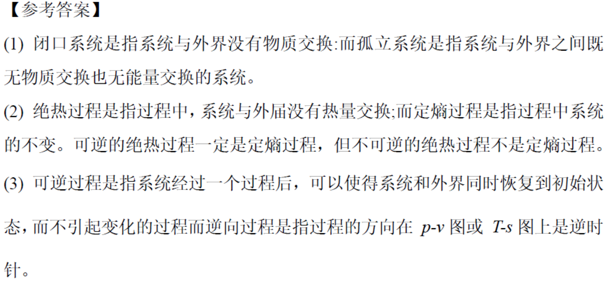

# 第一章 基本概念及定义   章节学习自检

## 第一部分

### 1. (单选题) (ID: 17681900)

**题干:**

**选项:**
- B
- D
- C
- A

**正确答案:**
B

---

### 2. (判断题) (ID: 17681908)

**题干:**

**正确答案:**
true

---

### 3. (填空题/简答题) (ID: 17681920)

**题干:**

**正确答案:**

---

### 4. (单选题) (ID: 17681901)

**题干:**

**选项:**
- C
- A
- D
- B

**正确答案:**
B

---

### 5. (填空题/简答题) (ID: 17681919)

**题干:**

**正确答案:**

---

### 6. (判断题) (ID: 17681914)

**题干:**

**正确答案:**
true

---

### 7. (填空题/简答题) (ID: 17681924)

**题干:**

**正确答案:**

---

### 8. (单选题) (ID: 17681898)

**题干:**

**选项:**
- D
- B
- A
- C

**正确答案:**
A

---

### 9. (填空题/简答题) (ID: 17681923)

**题干:**

**正确答案:**

---

### 10. (填空题/简答题) (ID: 17681922)

**题干:**

**正确答案:**

---

### 11. (填空题/简答题) (ID: 17681925)

**题干:**

**正确答案:**

---

### 12. (判断题) (ID: 17681912)

**题干:**

**正确答案:**
false

---

### 13. (单选题) (ID: 17681905)

**题干:**

**选项:**
- B
- A
- C
- D

**正确答案:**
D

---

### 14. (判断题) (ID: 17681910)

**题干:**

**正确答案:**
false

---

### 15. (单选题) (ID: 17681904)

**题干:**

**选项:**
- A
- C
- B

**正确答案:**
A

---

### 16. (单选题) (ID: 17681899)

**题干:**

**选项:**
- A
- B
- D
- C

**正确答案:**
C

---

### 17. (判断题) (ID: 17681911)

**题干:**

**正确答案:**
true

---

### 18. (判断题) (ID: 17681915)

**题干:**

**正确答案:**
true

---

### 19. (填空题/简答题) (ID: 17681926)

**题干:**

**正确答案:**

---

### 20. (单选题) (ID: 17681902)

**题干:**

**选项:**
- B
- C
- D
- A

**正确答案:**
C

---

### 21. (判断题) (ID: 17681907)

**题干:**

**正确答案:**
true

**答案解析:**

---

### 22. (单选题) (ID: 17681906)

**题干:**

**选项:**
- C
- B
- D
- A

**正确答案:**
B

---

### 23. (填空题/简答题) (ID: 17681918)

**题干:**

**正确答案:**

---

### 24. (填空题/简答题) (ID: 17681921)

**题干:**

**正确答案:**

---

### 25. (单选题) (ID: 17681903)

**题干:**

**选项:**
- B
- C
- A

**正确答案:**
C

---

### 26. (判断题) (ID: 17681909)

**题干:**

**正确答案:**
true

---

### 27. (判断题) (ID: 17681916)

**题干:**

**正确答案:**
true

---

### 28. (判断题) (ID: 17681913)

**题干:**

**正确答案:**
true

---

### 29. (单选题) (ID: 17681897)

**题干:**

**选项:**
- B
- D
- A
- C

**正确答案:**
C

---

### 30. (填空题/简答题) (ID: 17681917)

**题干:**

**正确答案:**

---

### 31. (填空题/简答题) (ID: 17681927)

**题干:**

**正确答案:**

---

