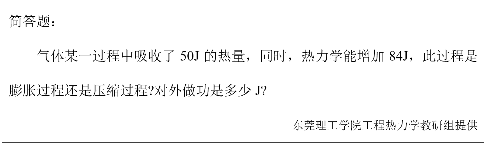

# 第二章 热力学第一定律 章节学习自检

## 第一部分

### 1. (判断题) (ID: 17718566)

**题干:**

**正确答案:**
false

---

### 2. (填空题/简答题) (ID: 17718570)

**题干:**

**正确答案:**

---

### 3. (判断题) (ID: 17718564)

**题干:**

**正确答案:**
false

---

### 4. (判断题) (ID: 17718562)

**题干:**

**正确答案:**
false

---

### 5. (判断题) (ID: 17718565)

**题干:**

**正确答案:**
false

---

### 6. (单选题) (ID: 17718552)

**题干:**

**选项:**
- A
- B
- C
- D

**正确答案:**
C

---

### 7. (填空题/简答题) (ID: 17718575)

**题干:**

**正确答案:**

---

### 8. (判断题) (ID: 17718560)

**题干:**

**正确答案:**
false

---

### 9. (不定项选择题) (ID: 17718569)

**题干:**
答案为：( )，( )

**正确答案:**
准静态
任何

---

### 10. (判断题) (ID: 17718568)

**题干:**

**正确答案:**
true

---

### 11. (判断题) (ID: 17718558)

**题干:**

**正确答案:**
false

---

### 12. (填空题/简答题) (ID: 17718576)

**题干:**

**正确答案:**

---

### 13. (判断题) (ID: 17718567)

**题干:**

**正确答案:**
true

---

### 14. (单选题) (ID: 17718557)

**题干:**

**选项:**
- A
- B
- C

**正确答案:**
A

**答案解析:**
充气的过程中增加了流动功，故导致瓶子气体的内能升高，温度升高。

---

### 15. (判断题) (ID: 17718563)

**题干:**

**正确答案:**
true

---

### 16. (单选题) (ID: 17718549)

**题干:**

**选项:**
- A
- B
- C
- D

**正确答案:**
A

---

### 17. (填空题/简答题) (ID: 17718574)

**题干:**

**正确答案:**

---

### 18. (单选题) (ID: 17718554)

**题干:**

**选项:**
- A
- B
- C
- D

**正确答案:**
C

---

### 19. (单选题) (ID: 17718556)

**题干:**

**选项:**
- A
- B
- C
- D

**正确答案:**
C

---

### 20. (单选题) (ID: 17718555)

**题干:**

**选项:**
- A
- B
- C
- D

**正确答案:**
A

---

### 21. (单选题) (ID: 17718553)

**题干:**

**选项:**
- A
- B
- C
- D

**正确答案:**
C

---

### 22. (判断题) (ID: 17718561)

**题干:**

**正确答案:**
false

---

### 23. (判断题) (ID: 17718559)

**题干:**

**正确答案:**
true

---

### 24. (单选题) (ID: 17718550)

**题干:**

**选项:**
- A
- B
- C
- D

**正确答案:**
C

---

### 25. (填空题/简答题) (ID: 17718572)

**题干:**

**正确答案:**

---

### 26. (填空题/简答题) (ID: 17718573)

**题干:**

**正确答案:**

---

### 27. (单选题) (ID: 17718551)

**题干:**

**选项:**
- A
- B
- C
- D

**正确答案:**
D

---

### 28. (填空题/简答题) (ID: 17718571)

**题干:**

**正确答案:**

---

