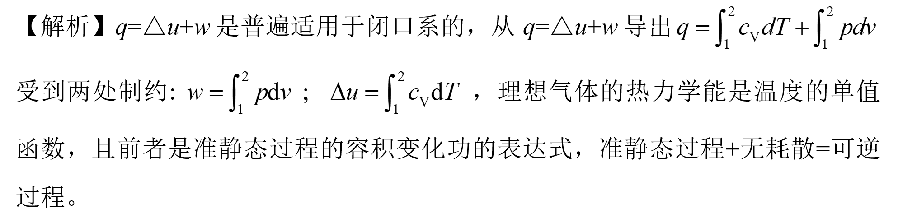

# 第三章 气体与蒸汽的性质 章节学习自检

## 第一部分

### 1. (填空题/简答题) (ID: 17718614)

**题干:**

**正确答案:**

---

### 2. (判断题) (ID: 17718632)

**题干:**

**正确答案:**
false

**答案解析:**

---

### 3. (判断题) (ID: 17718633)

**题干:**

**正确答案:**
false

**答案解析:**

---

### 4. (填空题/简答题) (ID: 17718612)

**题干:**

**正确答案:**

---

### 5. (填空题/简答题) (ID: 17718610)

**题干:**

**正确答案:**

---

### 6. (填空题/简答题) (ID: 17718615)

**题干:**

**正确答案:**

---

### 7. (单选题) (ID: 17718623)

**题干:**

**选项:**
- A
- B
- C
- D

**正确答案:**
A

---

### 8. (单选题) (ID: 17718617)

**题干:**

**选项:**
- A
- B
- C
- D

**正确答案:**
D

---

### 9. (单选题) (ID: 17718624)

**题干:**

**选项:**
- A
- B
- C
- D

**正确答案:**
C

**答案解析:**

---

### 10. (单选题) (ID: 17718620)

**题干:**

**选项:**
- A
- B
- C
- D

**正确答案:**
A

**答案解析:**

---

### 11. (判断题) (ID: 17718626)

**题干:**

**正确答案:**
false

**答案解析:**

---

### 12. (判断题) (ID: 17718630)

**题干:**

**正确答案:**
false

**答案解析:**

---

### 13. (单选题) (ID: 17718618)

**题干:**

**选项:**
- A
- B
- C
- D

**正确答案:**
D

---

### 14. (填空题/简答题) (ID: 17718609)

**题干:**

**正确答案:**

---

### 15. (单选题) (ID: 17718619)

**题干:**

**选项:**
- A
- B
- C
- D

**正确答案:**
B

**答案解析:**

---

### 16. (填空题/简答题) (ID: 17718611)

**题干:**

**正确答案:**

---

### 17. (判断题) (ID: 17718629)

**题干:**

**正确答案:**
false

---

### 18. (判断题) (ID: 17718631)

**题干:**

**正确答案:**
false

**答案解析:**

---

### 19. (填空题/简答题) (ID: 17718616)

**题干:**

**正确答案:**

---

### 20. (判断题) (ID: 17718627)

**题干:**

**正确答案:**
true

---

### 21. (填空题/简答题) (ID: 17718613)

**题干:**

**正确答案:**

---

### 22. (单选题) (ID: 17718621)

**题干:**

**选项:**
- A
- B
- C
- D

**正确答案:**
C

---

### 23. (单选题) (ID: 17718625)

**题干:**

**选项:**
- A
- B
- C
- D

**正确答案:**
A

**答案解析:**

---

### 24. (判断题) (ID: 17718628)

**题干:**

**正确答案:**
false

---

### 25. (单选题) (ID: 17718622)

**题干:**

**选项:**
- A
- B
- D

**正确答案:**
A

---

