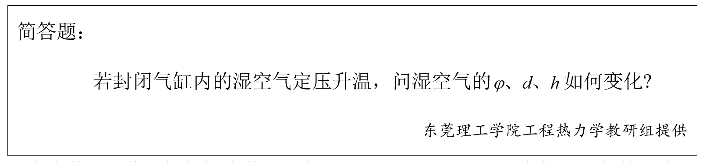

# 第四章 理想气体混合物及湿空气 章节学习自检

## 第一部分

### 1. (填空题/简答题) (ID: 17757917)

**题干:**

**正确答案:**

---

### 2. (填空题/简答题) (ID: 17757914)

**题干:**

**正确答案:**

---

### 3. (判断题) (ID: 17757912)

**题干:**

**正确答案:**
true

---

### 4. (填空题/简答题) (ID: 17757918)

**题干:**

**正确答案:**

---

### 5. (填空题/简答题) (ID: 17757916)

**题干:**

**正确答案:**

---

### 6. (单选题) (ID: 17757906)

**题干:**

**选项:**
- A
- B
- C
- D

**正确答案:**
B

---

### 7. (单选题) (ID: 17757904)

**题干:**

**选项:**
- A
- B
- C
- D

**正确答案:**
C

**答案解析:**

---

### 8. (判断题) (ID: 17757913)

**题干:**

**正确答案:**
false

---

### 9. (判断题) (ID: 17757908)

**题干:**

**正确答案:**
false

**答案解析:**

---

### 10. (单选题) (ID: 17757905)

**题干:**

**选项:**
- A
- B
- C
- D

**正确答案:**
C

**答案解析:**

---

### 11. (单选题) (ID: 17757901)

**题干:**

**选项:**
- A
- B
- C
- D

**正确答案:**
C

---

### 12. (判断题) (ID: 17757907)

**题干:**

**正确答案:**
false

---

### 13. (单选题) (ID: 17757898)

**题干:**

**选项:**
- A
- B
- C
- D

**正确答案:**
A

---

### 14. (单选题) (ID: 17757902)

**题干:**

**选项:**
- A
- B
- C
- D

**正确答案:**
D

---

### 15. (单选题) (ID: 17757899)

**题干:**

**选项:**
- A
- B
- C
- D

**正确答案:**
D

---

### 16. (单选题) (ID: 17757900)

**题干:**

**选项:**
- A
- B
- C
- D

**正确答案:**
C

---

### 17. (判断题) (ID: 17757911)

**题干:**

**正确答案:**
false

**答案解析:**

---

### 18. (判断题) (ID: 17757910)

**题干:**

**正确答案:**
true

---

### 19. (填空题/简答题) (ID: 17757919)

**题干:**

**正确答案:**

---

### 20. (填空题/简答题) (ID: 17757920)

**题干:**

**正确答案:**

---

### 21. (填空题/简答题) (ID: 17757921)

**题干:**

**正确答案:**

---

### 22. (填空题/简答题) (ID: 17757915)

**题干:**

**正确答案:**

---

### 23. (单选题) (ID: 17757903)

**题干:**

**选项:**
- A
- B
- C
- D

**正确答案:**
C

---

### 24. (判断题) (ID: 17757909)

**题干:**

**正确答案:**
false

---

