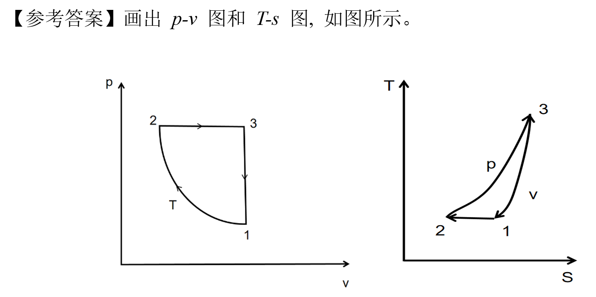

# 第五章 气体和蒸汽基本热力学过程 章节学习自检

## 第一部分

### 1. (单选题) (ID: 17757926)

**题干:**

**选项:**
- A
- B
- C
- D

**正确答案:**
B

**答案解析:**

---

### 2. (单选题) (ID: 17757922)

**题干:**

**选项:**
- A
- B
- C
- D

**正确答案:**
D

---

### 3. (判断题) (ID: 17757930)

**题干:**

**正确答案:**
false

**答案解析:**

---

### 4. (填空题/简答题) (ID: 17757938)

**题干:**

**正确答案:**

---

### 5. (填空题/简答题) (ID: 17757937)

**题干:**

**正确答案:**

---

### 6. (判断题) (ID: 17757932)

**题干:**

**正确答案:**
true

---

### 7. (填空题/简答题) (ID: 17757933)

**题干:**

**正确答案:**

---

### 8. (单选题) (ID: 17757925)

**题干:**

**选项:**
- A
- B
- C
- D

**正确答案:**
B

**答案解析:**

---

### 9. (单选题) (ID: 17757927)

**题干:**

**选项:**
- A
- B
- C
- D

**正确答案:**
C

**答案解析:**

---

### 10. (判断题) (ID: 17757929)

**题干:**

**正确答案:**
false

---

### 11. (单选题) (ID: 17757923)

**题干:**

**选项:**
- A
- B
- C
- D

**正确答案:**
B

**答案解析:**

---

### 12. (判断题) (ID: 17757931)

**题干:**

**正确答案:**
false

**答案解析:**

---

### 13. (单选题) (ID: 17757928)

**题干:**

**选项:**
- A
- B
- C
- D

**正确答案:**
A

---

### 14. (填空题/简答题) (ID: 17757936)

**题干:**

**正确答案:**

---

### 15. (单选题) (ID: 17757924)

**题干:**

**选项:**
- A
- B
- C
- D

**正确答案:**
C

---

### 16. (填空题/简答题) (ID: 17757934)

**题干:**

**正确答案:**

---

### 17. (填空题/简答题) (ID: 17757935)

**题干:**

**正确答案:**

---

