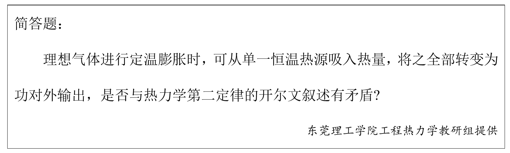

# 第六章 热力学第二定律 章节学习自检

## 第一部分

### 1. (填空题/简答题) (ID: 17757964)

**题干:**

**正确答案:**

---

### 2. (判断题) (ID: 17757956)

**题干:**

**正确答案:**
false

---

### 3. (单选题) (ID: 17757949)

**题干:**

**选项:**
- A
- B
- C
- D

**正确答案:**
C

---

### 4. (单选题) (ID: 17757945)

**题干:**

**选项:**
- A
- B
- C
- D

**正确答案:**
B

---

### 5. (单选题) (ID: 17757946)

**题干:**

**选项:**
- A
- B
- C
- D

**正确答案:**
B

---

### 6. (判断题) (ID: 17757952)

**题干:**

**正确答案:**
false

---

### 7. (判断题) (ID: 17757953)

**题干:**

**正确答案:**
true

---

### 8. (填空题/简答题) (ID: 17757965)

**题干:**

**正确答案:**

---

### 9. (判断题) (ID: 17757957)

**题干:**

**正确答案:**
false

**答案解析:**

---

### 10. (单选题) (ID: 17757943)

**题干:**

**选项:**
- A
- B
- C
- D

**正确答案:**
B

**答案解析:**

---

### 11. (判断题) (ID: 17757954)

**题干:**

**正确答案:**
false

---

### 12. (判断题) (ID: 17757951)

**题干:**

**正确答案:**
false

---

### 13. (单选题) (ID: 17757940)

**题干:**

**选项:**
- A
- B
- C
- D

**正确答案:**
D

**答案解析:**

---

### 14. (判断题) (ID: 17757955)

**题干:**

**正确答案:**
false

---

### 15. (判断题) (ID: 17757960)

**题干:**

**正确答案:**
true

---

### 16. (单选题) (ID: 17757948)

**题干:**

**选项:**
- A
- B
- C
- D

**正确答案:**
D

---

### 17. (判断题) (ID: 17757950)

**题干:**

**正确答案:**
false

**答案解析:**

---

### 18. (单选题) (ID: 17757941)

**题干:**

**选项:**
- A
- B
- C
- D

**正确答案:**
D

**答案解析:**

---

### 19. (判断题) (ID: 17757962)

**题干:**

**正确答案:**
true

---

### 20. (填空题/简答题) (ID: 17757966)

**题干:**

**正确答案:**

---

### 21. (填空题/简答题) (ID: 17757969)

**题干:**

**正确答案:**

---

### 22. (判断题) (ID: 17757958)

**题干:**

**正确答案:**
true

---

### 23. (填空题/简答题) (ID: 17757968)

**题干:**

**正确答案:**

---

### 24. (单选题) (ID: 17757942)

**题干:**

**选项:**
- A
- B
- C
- D

**正确答案:**
C

---

### 25. (单选题) (ID: 17757947)

**题干:**

**选项:**
- A
- B
- C
- D

**正确答案:**
B

**答案解析:**

---

### 26. (单选题) (ID: 17757939)

**题干:**

**选项:**
- A
- B
- C
- D

**正确答案:**
A

---

### 27. (判断题) (ID: 17757959)

**题干:**

**正确答案:**
false

---

### 28. (单选题) (ID: 17757944)

**题干:**

**选项:**
- A
- B
- C
- D

**正确答案:**
D

**答案解析:**

---

### 29. (填空题/简答题) (ID: 17757967)

**题干:**

**正确答案:**

---

### 30. (判断题) (ID: 17757961)

**题干:**

**正确答案:**
false

---

### 31. (填空题/简答题) (ID: 17757963)

**题干:**

**正确答案:**

---

