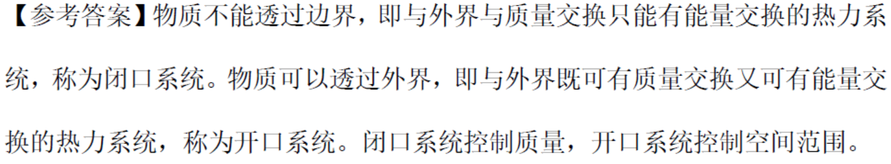

# 期中考试

## 第一部分

### 1. (判断题) (ID: 17780644)

**题干:**

**正确答案:**
false

---

### 2. (判断题) (ID: 17780642)

**题干:**

**正确答案:**
true

---

### 3. (判断题) (ID: 17780616)

**题干:**

**正确答案:**
false

**答案解析:**
【解析】气体自由膨胀是个不可逆过程

---

### 4. (填空题/简答题) (ID: 17780633)

**题干:**

**正确答案:**

---

### 5. (填空题/简答题) (ID: 17780568)

**题干:**

**正确答案:**

---

### 6. (填空题/简答题) (ID: 17780569)

**题干:**

**正确答案:**

---

### 7. (填空题/简答题) (ID: 17780628)

**题干:**

**正确答案:**

---

### 8. (判断题) (ID: 17780617)

**题干:**

**正确答案:**
false

**答案解析:**

---

### 9. (判断题) (ID: 17780590)

**题干:**

**正确答案:**
false

---

### 10. (判断题) (ID: 17780640)

**题干:**

**正确答案:**
true

---

### 11. (填空题/简答题) (ID: 17780577)

**题干:**

**正确答案:**

---

### 12. (单选题) (ID: 17780585)

**题干:**

**选项:**
- A
- B
- C
- D

**正确答案:**
D

---

### 13. (填空题/简答题) (ID: 17780575)

**题干:**

**正确答案:**

---

### 14. (单选题) (ID: 17780588)

**题干:**

**选项:**
- A
- B
- C
- D

**正确答案:**
D

**答案解析:**

---

### 15. (判断题) (ID: 17780639)

**题干:**

**正确答案:**
false

**答案解析:**

---

### 16. (填空题/简答题) (ID: 17780629)

**题干:**

**正确答案:**

---

### 17. (填空题/简答题) (ID: 17780582)

**题干:**

**正确答案:**

---

### 18. (单选题) (ID: 17780573)

**题干:**

**选项:**
- A
- B
- C
- D

**正确答案:**
B

---

### 19. (单选题) (ID: 17780581)

**题干:**

**选项:**
- A
- B
- C
- D

**正确答案:**
C

---

### 20. (单选题) (ID: 17780604)

**题干:**

**选项:**
- A
- B
- C
- D

**正确答案:**
C

**答案解析:**

---

### 21. (单选题) (ID: 17780574)

**题干:**

**选项:**
- A
- B
- C

**正确答案:**
A

---

### 22. (填空题/简答题) (ID: 17780601)

**题干:**

**正确答案:**

---

### 23. (单选题) (ID: 17780580)

**题干:**

**选项:**
- A
- B
- C
- D

**正确答案:**
D

---

### 24. (判断题) (ID: 17780641)

**题干:**

**正确答案:**
false

**答案解析:**

---

### 25. (单选题) (ID: 17780603)

**题干:**

**选项:**
- A
- B
- C
- D

**正确答案:**
B

**答案解析:**

---

### 26. (单选题) (ID: 17780586)

**题干:**

**选项:**
- A
- B
- C
- D

**正确答案:**
A

**答案解析:**

---

### 27. (判断题) (ID: 17780589)

**题干:**

**正确答案:**
false

**答案解析:**

---

### 28. (判断题) (ID: 17780643)

**题干:**

**正确答案:**
false

---

### 29. (单选题) (ID: 17780634)

**题干:**

**选项:**
- A
- B
- C
- D

**正确答案:**
D

---

