# 第七章 气体和蒸汽的流动 章节学习自检

## 第一部分

### 1. (判断题) (ID: 17831285)

**题干:**

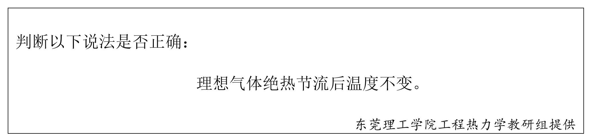

**正确答案:**
true

---

### 2. (单选题) (ID: 17831276)

**题干:**

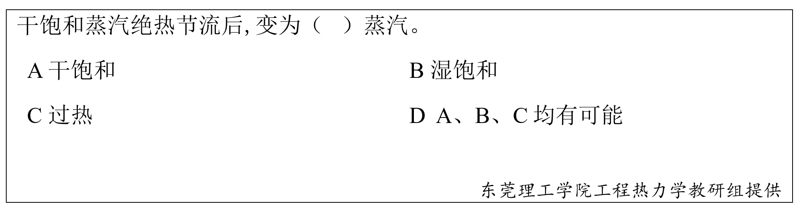

**选项:**
- A
- B
- C
- D

**正确答案:**
D

**答案解析:**

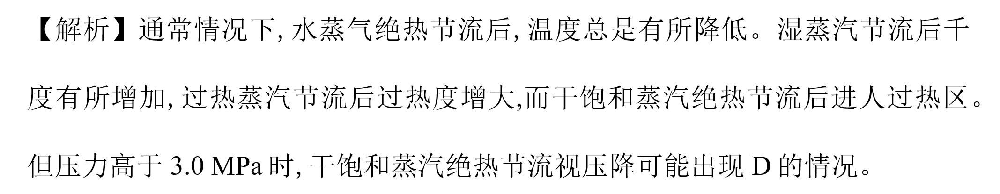

---

### 3. (单选题) (ID: 17831275)

**题干:**

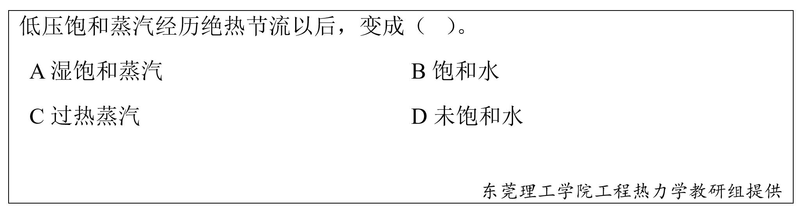

**选项:**
- A
- B
- C
- D

**正确答案:**
C

**答案解析:**

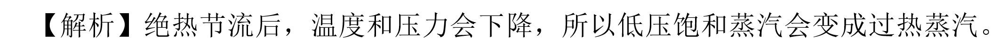

---

### 4. (判断题) (ID: 17831287)

**题干:**

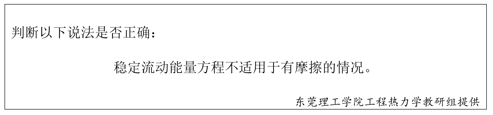

**正确答案:**
false

**答案解析:**

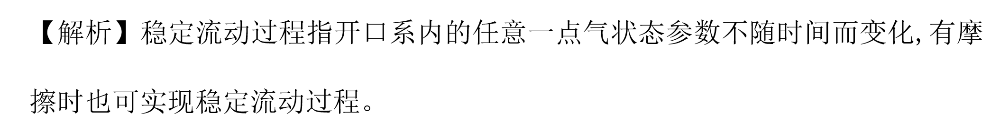

---

### 5. (填空题/简答题) (ID: 17831293)

**题干:**

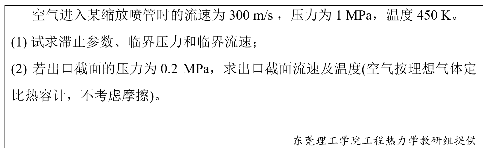

**正确答案:**

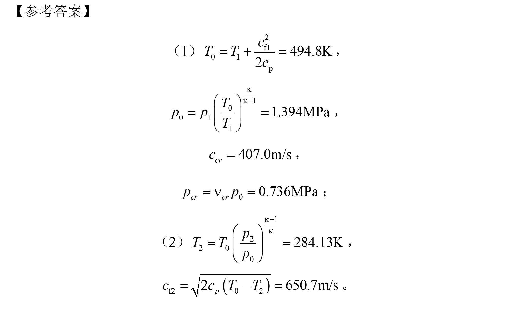

---

### 6. (单选题) (ID: 17831279)

**题干:**

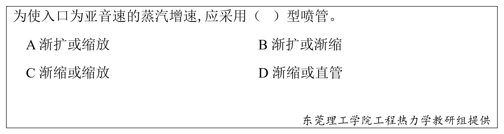

**选项:**
- A
- B
- C
- D

**正确答案:**
C

**答案解析:**

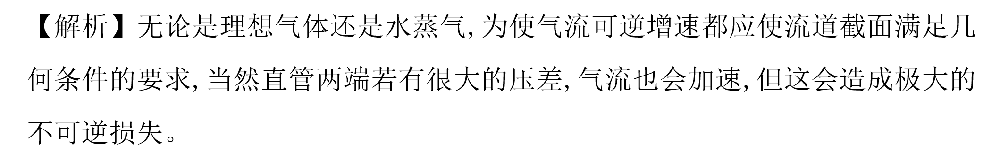

---

### 7. (填空题/简答题) (ID: 17831292)

**题干:**

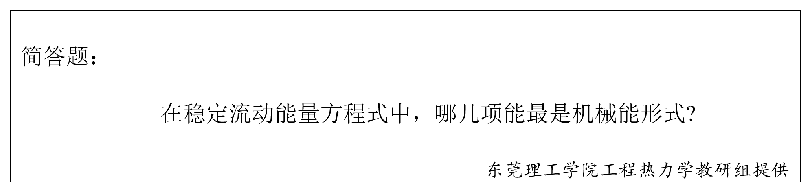

**正确答案:**

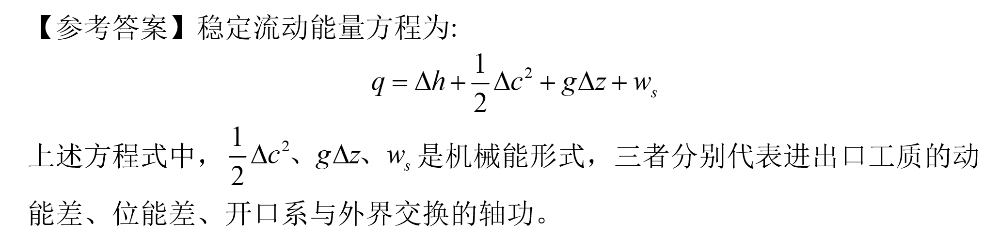

---

### 8. (单选题) (ID: 17831274)

**题干:**

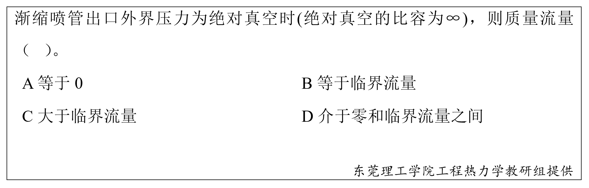

**选项:**
- A
- B
- C
- D

**正确答案:**
B

---

### 9. (单选题) (ID: 17831273)

**题干:**

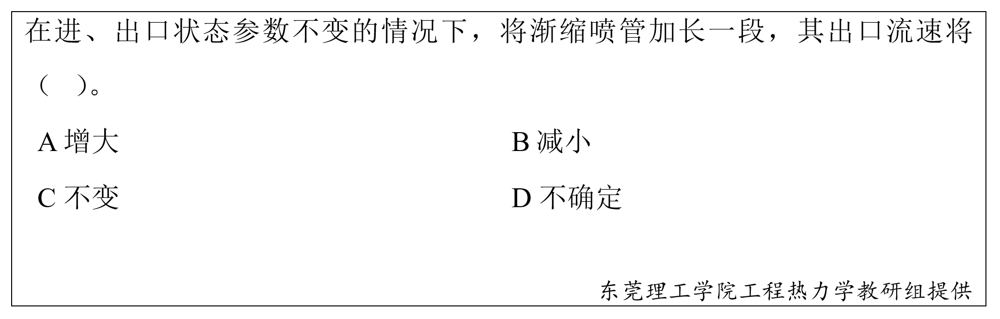

**选项:**
- A
- B
- C
- D

**正确答案:**
C

---

### 10. (判断题) (ID: 17831284)

**题干:**

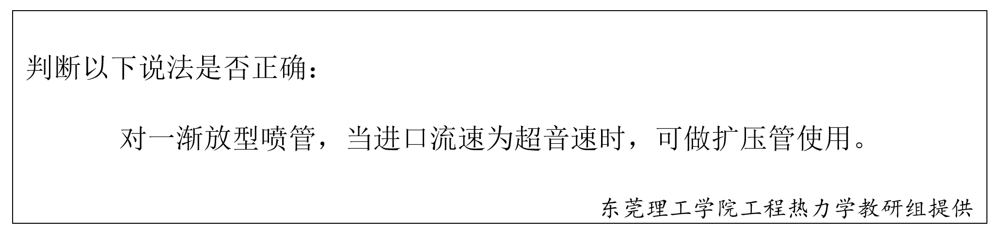

**正确答案:**
false

---

### 11. (填空题/简答题) (ID: 17831289)

**题干:**

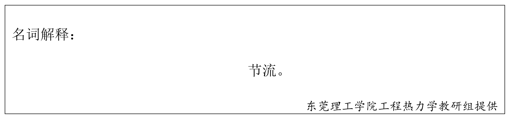

**正确答案:**

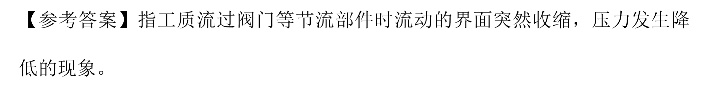

---

### 12. (单选题) (ID: 17831280)

**题干:**

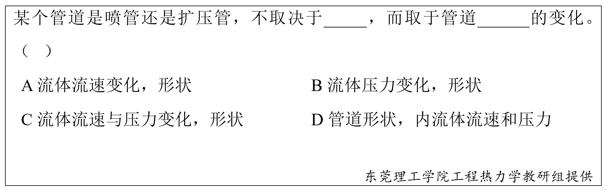

**选项:**
- A
- B
- C
- D

**正确答案:**
D

**答案解析:**

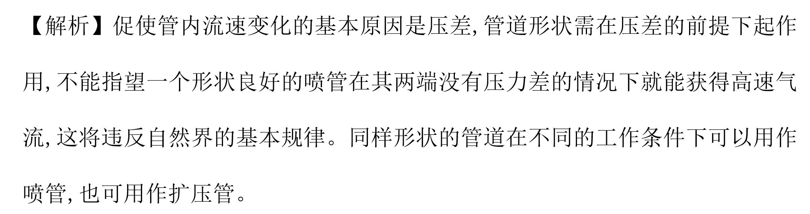

---

### 13. (单选题) (ID: 17831272)

**题干:**

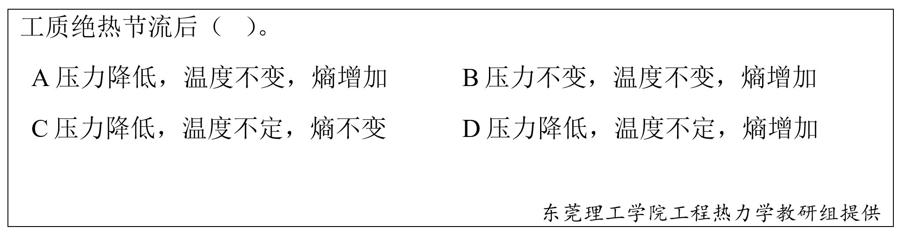

**选项:**
- A
- B
- C
- D

**正确答案:**
D

---

### 14. (单选题) (ID: 17831271)

**题干:**

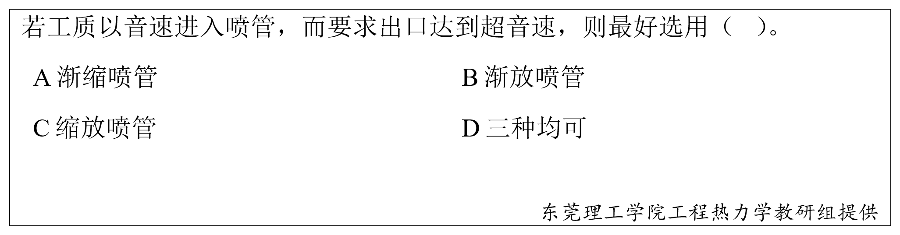

**选项:**
- A
- B
- C
- D

**正确答案:**
B

---

### 15. (判断题) (ID: 17831281)

**题干:**

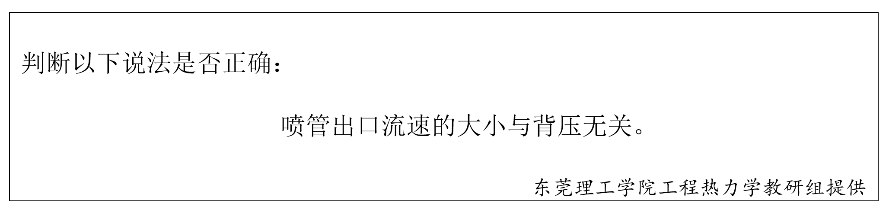

**正确答案:**
false

---

### 16. (单选题) (ID: 17831278)

**题干:**

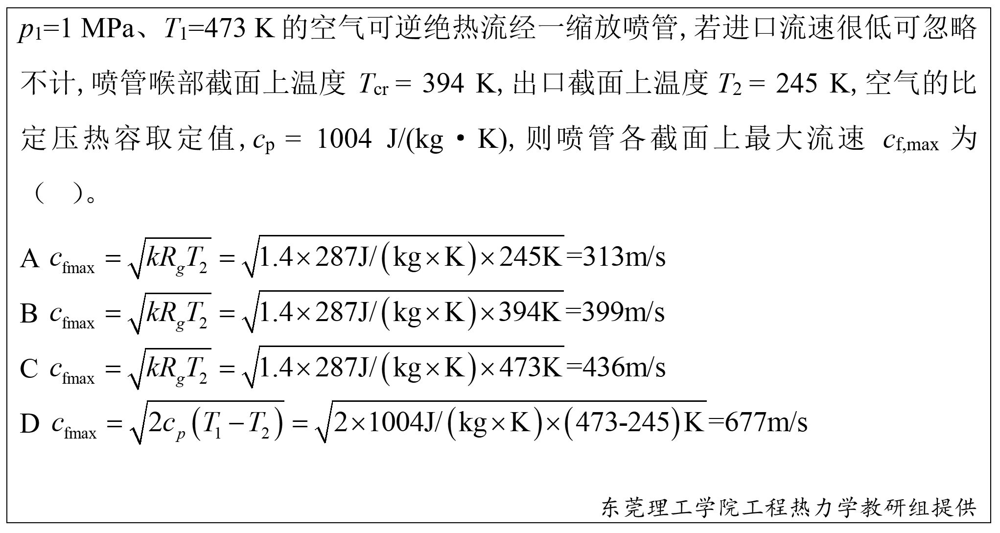

**选项:**
- A
- B
- C
- D

**正确答案:**
D

**答案解析:**

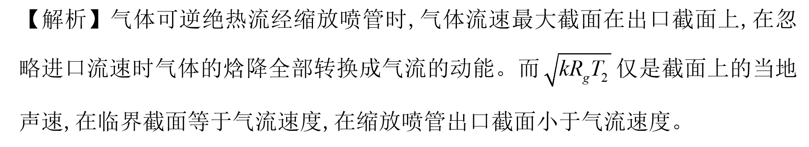

---

### 17. (填空题/简答题) (ID: 17831290)

**题干:**

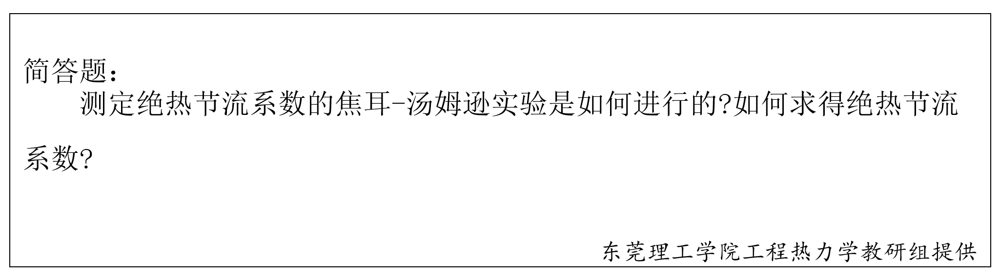

**正确答案:**

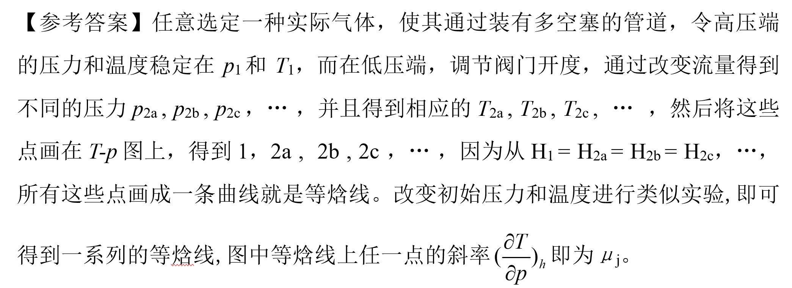

---

### 18. (判断题) (ID: 17831282)

**题干:**

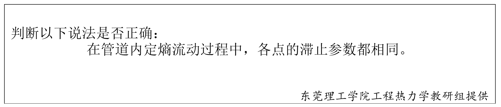

**正确答案:**
true

---

### 19. (单选题) (ID: 17831277)

**题干:**

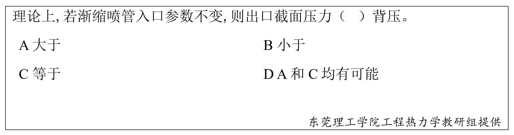

**选项:**
- A
- B
- C
- D

**正确答案:**
D

**答案解析:**

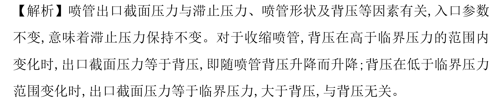

---

### 20. (判断题) (ID: 17831283)

**题干:**

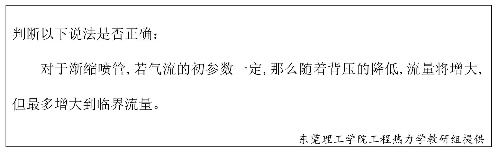

**正确答案:**
true

---

### 21. (填空题/简答题) (ID: 17831291)

**题干:**

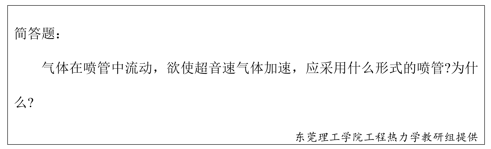

**正确答案:**

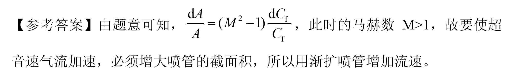

---

### 22. (判断题) (ID: 17831286)

**题干:**

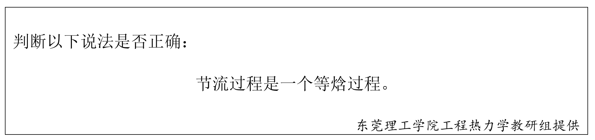

**正确答案:**
false

**答案解析:**

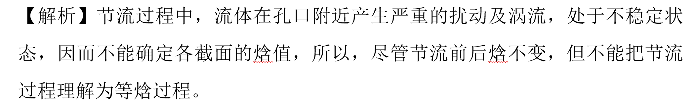

---

### 23. (判断题) (ID: 17831288)

**题干:**

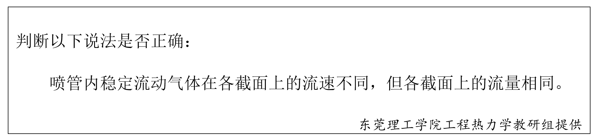

**正确答案:**
true

---

