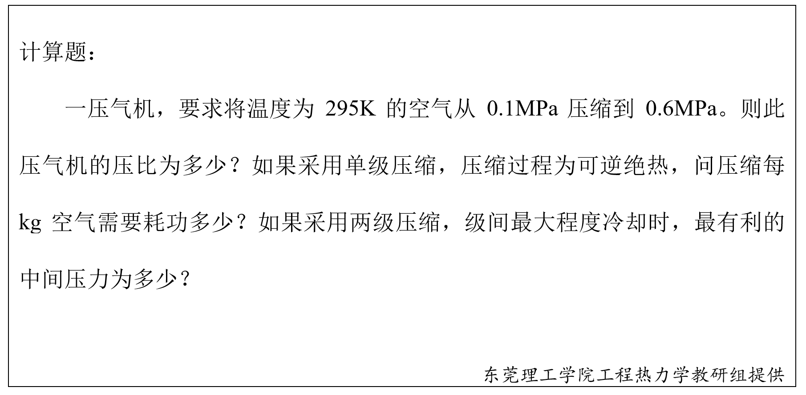

# 第八章 压气机的热力过程 章节学习自检

## 第一部分

### 1. (填空题/简答题) (ID: 17853823)

**题干:**

**正确答案:**

---

### 2. (填空题/简答题) (ID: 17853825)

**题干:**

**正确答案:**

---

### 3. (填空题/简答题) (ID: 17853828)

**题干:**

**正确答案:**

---

### 4. (单选题) (ID: 17853816)

**题干:**

**选项:**
- A
- B
- C
- D

**正确答案:**
C

---

### 5. (填空题/简答题) (ID: 17853826)

**题干:**

**正确答案:**

---

### 6. (判断题) (ID: 17853820)

**题干:**

**正确答案:**
true

**答案解析:**

---

### 7. (判断题) (ID: 17853821)

**题干:**

**正确答案:**
true

---

### 8. (填空题/简答题) (ID: 17853822)

**题干:**

**正确答案:**

---

### 9. (判断题) (ID: 17853819)

**题干:**

**正确答案:**
true

---

### 10. (判断题) (ID: 17853818)

**题干:**

**正确答案:**
true

---

### 11. (填空题/简答题) (ID: 17853824)

**题干:**

**正确答案:**

---

### 12. (判断题) (ID: 17853817)

**题干:**

**正确答案:**
false

**答案解析:**

---

### 13. (填空题/简答题) (ID: 17853827)

**题干:**

**正确答案:**

---

### 14. (单选题) (ID: 17853814)

**题干:**

**选项:**
- A
- B
- C
- D

**正确答案:**
B

---

### 15. (单选题) (ID: 17853815)

**题干:**

**选项:**
- A
- B
- C
- D

**正确答案:**
C

**答案解析:**

---

