# 第九章 气体动力循环

## 第一部分

### 1. (填空题/简答题) (ID: 17859586)

**题干:**

**正确答案:**

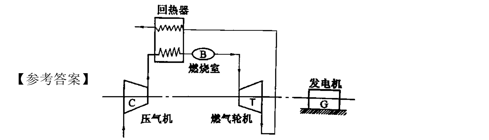

---

### 2. (单选题) (ID: 17859591)

**题干:**

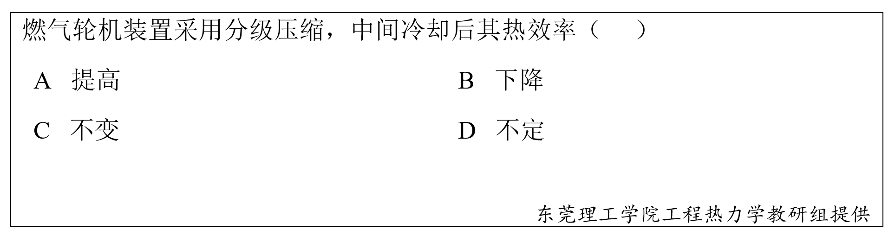

**选项:**
- A
- B
- C
- D

**正确答案:**
D

**答案解析:**

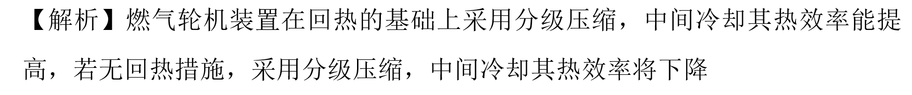

---

### 3. (填空题/简答题) (ID: 17859584)

**题干:**

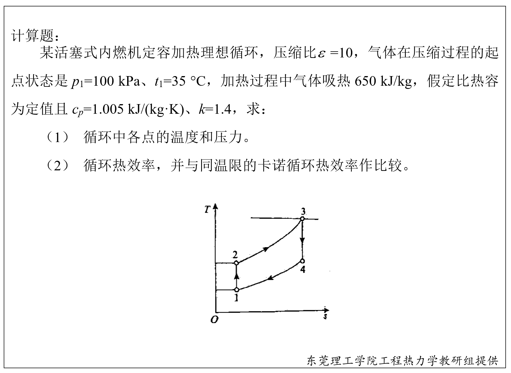

**正确答案:**

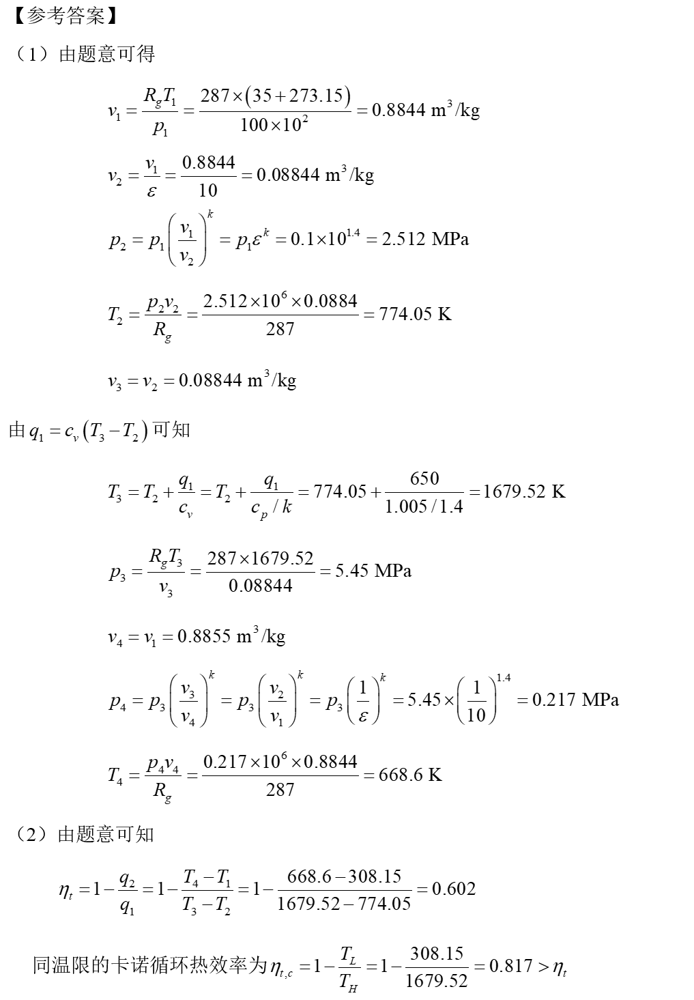

---

### 4. (单选题) (ID: 17859589)

**题干:**

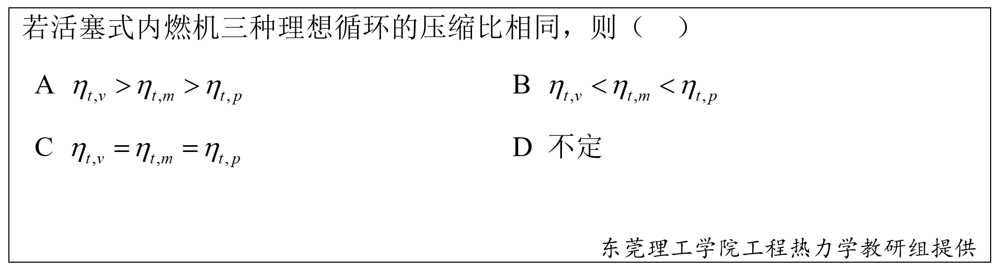

**选项:**
- A
- B
- C
- D

**正确答案:**
D

**答案解析:**

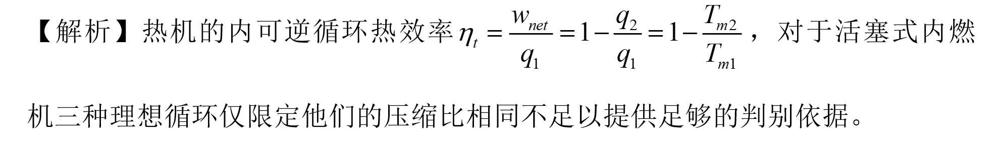

---

### 5. (多选题) (ID: 17859590)

**题干:**

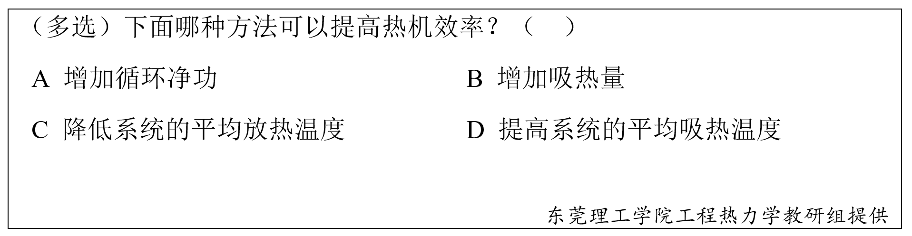

**选项:**
- A
- B
- C
- D

**正确答案:**
C
D

---

### 6. (填空题/简答题) (ID: 17859585)

**题干:**

**正确答案:**

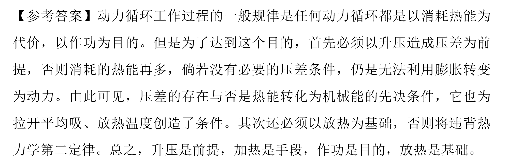

---

### 7. (判断题) (ID: 17859588)

**题干:**

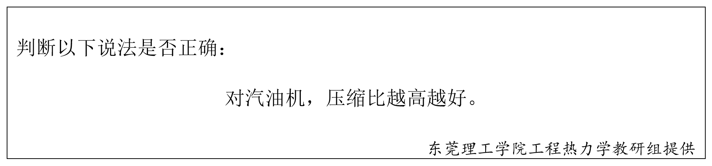

**正确答案:**
false

---

### 8. (填空题/简答题) (ID: 17859587)

**题干:**

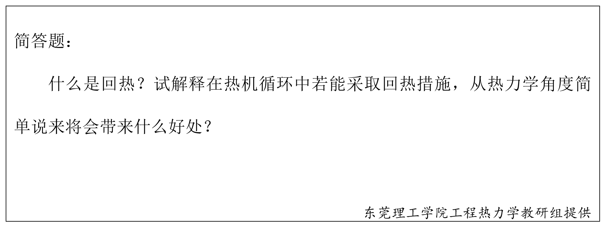

**正确答案:**

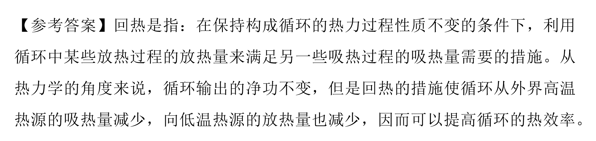

---

### 9. (单选题) (ID: 17859593)

**题干:**

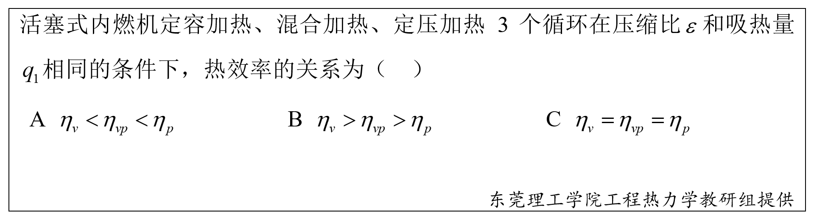

**选项:**
- A
- B
- C
- D

**正确答案:**
B

**答案解析:**

---

### 10. (单选题) (ID: 17859592)

**题干:**

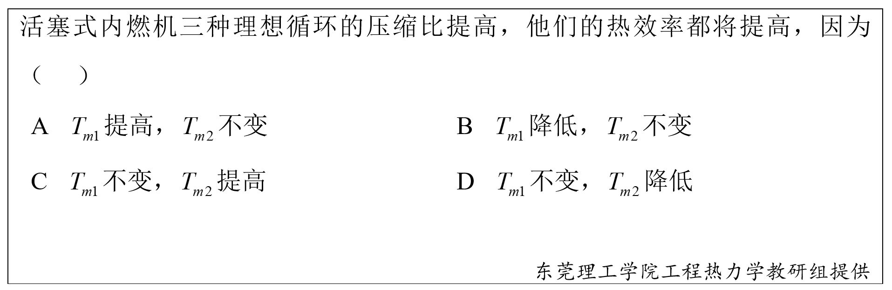

**选项:**
- A
- B
- C
- D

**正确答案:**
A

**答案解析:**

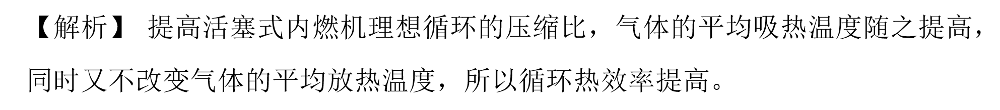

---

