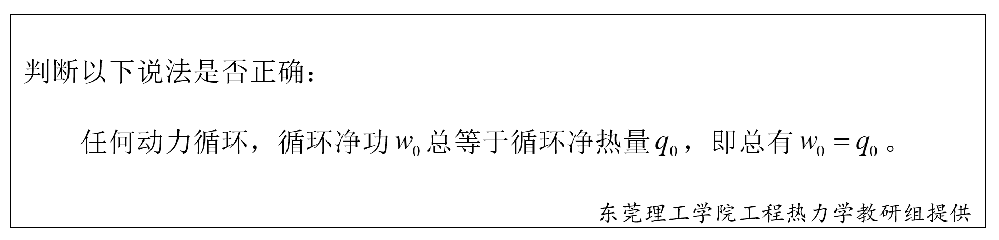

# 第十章 蒸汽动力装置循环

## 第一部分

### 1. (填空题/简答题) (ID: 17945259)

**题干:**

**正确答案:**

---

### 2. (填空题/简答题) (ID: 17945260)

**题干:**

**正确答案:**

---

### 3. (填空题/简答题) (ID: 17945261)

**题干:**

**正确答案:**

---

### 4. (填空题/简答题) (ID: 17945262)

**题干:**

**正确答案:**

---

### 5. (判断题) (ID: 17945263)

**题干:**

**正确答案:**
true

**答案解析:**

---

### 6. (判断题) (ID: 17945264)

**题干:**

**正确答案:**
false

**答案解析:**

---

### 7. (判断题) (ID: 17945265)

**题干:**

**正确答案:**
true

---

### 8. (判断题) (ID: 17945266)

**题干:**

**正确答案:**
true

---

### 9. (单选题) (ID: 17945267)

**题干:**

**选项:**
- A
- B
- C
- D

**正确答案:**
D

**答案解析:**

---

### 10. (单选题) (ID: 17945268)

**题干:**

**选项:**
- A
- B
- C
- D

**正确答案:**
A

**答案解析:**

---

### 11. (单选题) (ID: 17945269)

**题干:**

**选项:**
- A
- B
- C
- D

**正确答案:**
C

**答案解析:**

---

### 12. (单选题) (ID: 17945270)

**题干:**

**选项:**
- A
- B
- C
- D

**正确答案:**
C

**答案解析:**

---

