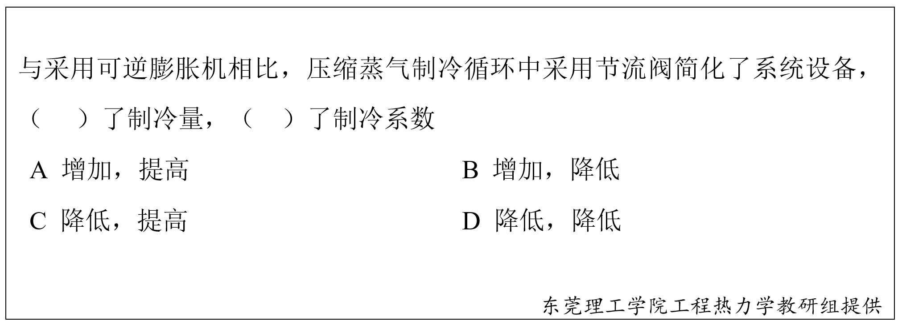

# 第十一章 制冷循环 章节学习自检

## 第一部分

### 1. (填空题/简答题) (ID: 17901426)

**题干:**

**正确答案:**

---

### 2. (判断题) (ID: 17901438)

**题干:**

**正确答案:**
true

---

### 3. (填空题/简答题) (ID: 17901432)

**题干:**

**正确答案:**

---

### 4. (多选题) (ID: 17901439)

**题干:**

**选项:**
- A
- B
- C
- ABC

**正确答案:**
D

---

### 5. (填空题/简答题) (ID: 17901429)

**题干:**

**正确答案:**

---

### 6. (判断题) (ID: 17901437)

**题干:**

**正确答案:**
true

---

### 7. (判断题) (ID: 17901434)

**题干:**

**正确答案:**
false

**答案解析:**

---

### 8. (填空题/简答题) (ID: 17901431)

**题干:**

**正确答案:**

---

### 9. (单选题) (ID: 17901441)

**题干:**

**选项:**
- A
- B
- C
- D

**正确答案:**
D

**答案解析:**

---

### 10. (判断题) (ID: 17901436)

**题干:**

**正确答案:**
false

**答案解析:**

---

### 11. (填空题/简答题) (ID: 17901427)

**题干:**

**正确答案:**

---

### 12. (判断题) (ID: 17901433)

**题干:**

**正确答案:**
false

**答案解析:**

---

### 13. (单选题) (ID: 17901440)

**题干:**

**选项:**
- A
- B
- C
- D

**正确答案:**
D

---

### 14. (判断题) (ID: 17901435)

**题干:**

**正确答案:**
true

---

### 15. (单选题) (ID: 17901444)

**题干:**

**选项:**
- A
- B
- C
- D

**正确答案:**
C

**答案解析:**

---

### 16. (填空题/简答题) (ID: 17901428)

**题干:**

**正确答案:**

---

### 17. (单选题) (ID: 17901442)

**题干:**

**选项:**
- A
- B
- C
- D

**正确答案:**
A

---

### 18. (单选题) (ID: 17901443)

**题干:**

**选项:**
- A
- B
- C
- D

**正确答案:**
B

**答案解析:**

---

### 19. (填空题/简答题) (ID: 17901430)

**题干:**

**正确答案:**

---

